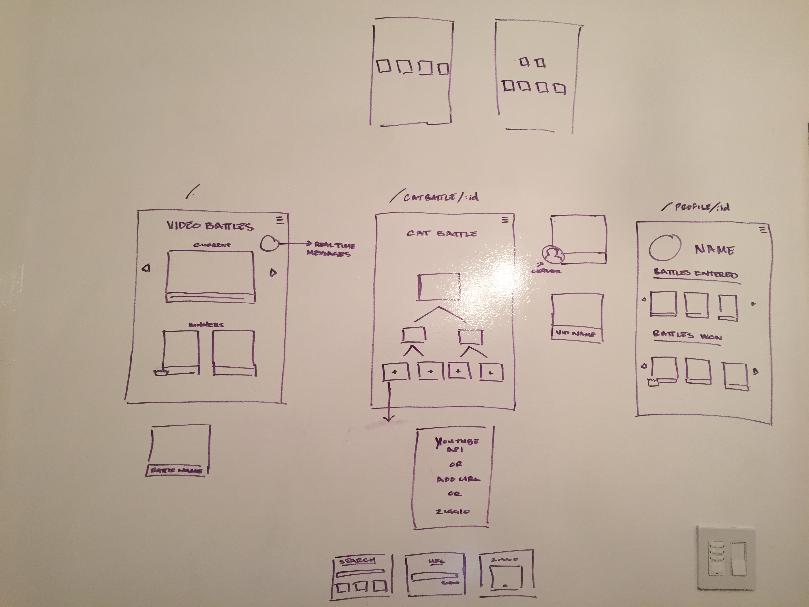
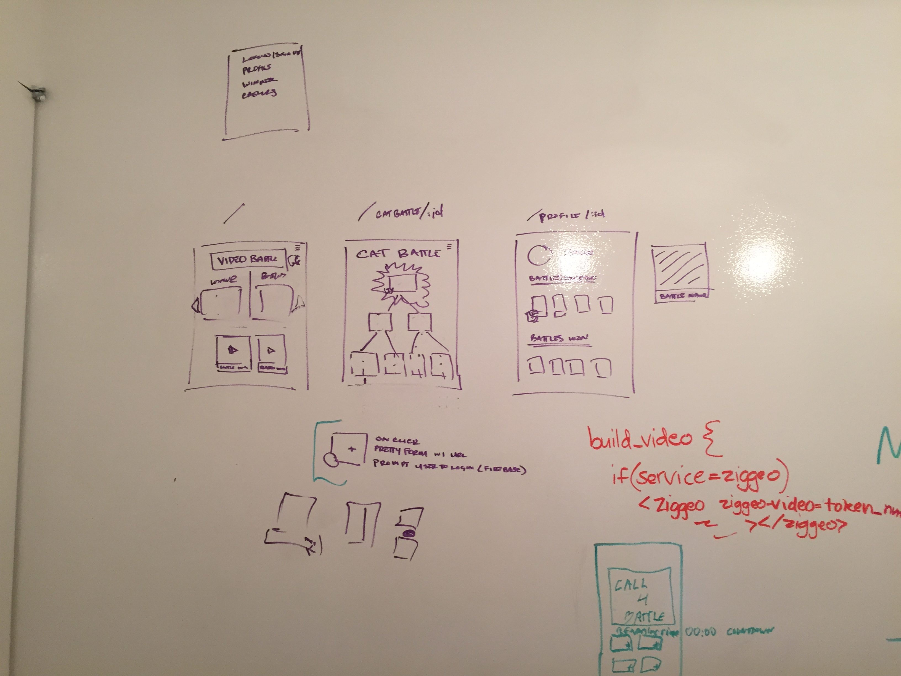

#Video Battle

Bringing the brackets craze to video! Video Battle is a fun way to use new or existing video to battle your friends and fellow webizens.

##Inspiration

The brackets you see in sports. We wanted to encourage engagement through 'gamification' of video!

##What Can I Do with Video Battle?

* Create video battles
* Video submission through Ziggeo or Youtube Search API
* Watch videos w/ Embed.ly, the YouTube Data API and Ziggeo's player
* See the battles happening now (in real time) using Firebase

###Yet To Come

* Integrate the Vine API (constructed but not incorporated to client-side) - Add videos from Vine
* Voting - Choose your favorites until a winner is crowned!
* Larger submission pools
* Multiple battle types
  * Open Submission: Submit videos into battle slots, then vote
  * Closed Submission: Right to the voting! Videos selected by the Battle Creator

##APIs Used

* YouTube Search API
* YouTube Data API
* Ziggeo API
* Firebase API

##Planning

##Team Fun Facts

* We're a bunch of co-workers from Waywire!
* 2 GA WDI Alums: Nessa Nguyen (NYC) and Sarah Mele (Boston)
* International: Gabe Vieira is Brazilian and Nessa is  Vietnamese
* Multi-talented: Michael Angelo & Sarah both sing opera and Nessa is an amazing hip-hop dancer

